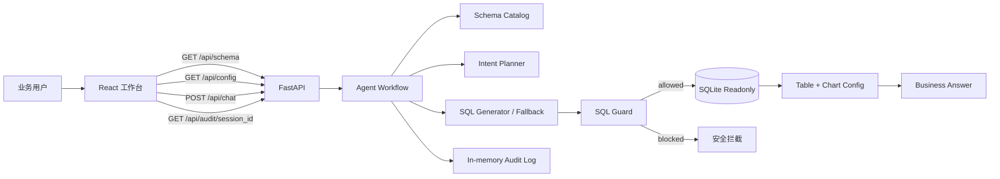
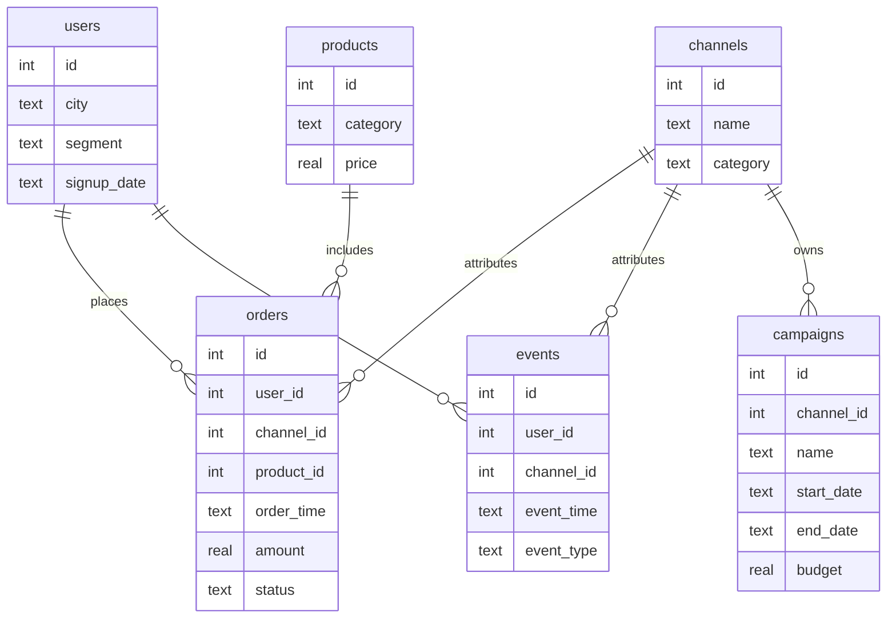

# 技术架构说明


## 总体架构



## 前端

前端是一个 Vite + React + TypeScript 单页应用。

主要文件：

- `src/App.tsx`：工作台主界面，包含 schema、对话、结果和审计。
- `src/api.ts`：封装后端 API 请求，支持 `public/runtime-config.js` 覆盖 API base。
- `src/types.ts`：前后端数据结构类型。
- `src/styles.css`：响应式布局和视觉样式。

页面结构：

- 顶部：当前数据库、只读模式、安全状态。
- 左侧：schema、表说明、字段列表、样例问题、安全演示入口。
- 中间：对话区、Agent 步骤、SQL、最终解释。
- 右侧：SQL guard 状态、图表、结果表格、审计轨迹。

新查询开始时，右侧会清空上一轮结果并显示当前 pending question，避免危险请求还残留上一轮绿色 guard。

## 后端

后端是 FastAPI 应用。

主要文件：

- `backend/app/main.py`：API 入口。
- `backend/app/config.py`：读取 `config/app.conf`、`.env` 和环境变量，集中管理 URL、端口、DB 路径和 reset 开关。
- `backend/app/agent.py`：Agent 工作流编排。
- `backend/app/database.py`：SQLite schema、种子数据和只读查询执行。
- `backend/app/schema_catalog.py`：表和字段业务说明。
- `backend/app/sql_guard.py`：SQL 安全解析和校验。
- `backend/app/llm_client.py`：OpenAI-compatible 模型调用封装。

## API

### `GET /api/config`

返回当前公开运行时配置：

- `configFile`
- `apiDisplay`
- `backend.host`
- `backend.port`
- `database.path`
- `database.resetEnabled`

### `GET /api/schema`

返回数据库元信息：

- 数据库名称
- 只读模式
- 业务日期
- 表结构
- 字段说明
- 样例值
- 样例问题

### `POST /api/chat`

请求：

```json
{
  "question": "最近 7 天 GMV 最高的渠道是什么？"
}
```

响应包含：

- `session_id`
- `steps`
- `sql`
- `guard`
- `columns`
- `rows`
- `chart`
- `answer`
- `suggestions`
- `blocked`

### `GET /api/audit/{session_id}`

返回指定会话的审计记录，包括：

- schema 读取
- 查询计划
- SQL 生成
- guard 结果
- 查询执行结果
- 最终回答

### `POST /api/demo/reset`

重置 SQLite 示例数据库。默认关闭，未显式设置 `database.reset_enabled = true` 或 `ENABLE_DEMO_RESET=true` 时返回 403。

## 配置流

```mermaid
flowchart LR
    CONF[config/app.conf] --> PY[backend/app/config.py]
    ENV[.env / environment] --> PY
    PY --> API[/api/config]
    CONF --> SYNC[npm run sync:config]
    ENV --> SYNC
    SYNC --> RUNTIME[public/runtime-config.js]
    RUNTIME --> FE[src/api.ts]
    PY --> DBPATH[SQLite DB Path]
    PY --> CORS[CORS Origins]
    PY --> RESET[Reset Gate]
```

配置优先级：

```text
环境变量 / .env > config/app.conf > 代码默认值
```

## 数据模型



## Agent 工作流


### 1. Schema Retrieve

读取 schema catalog，返回表名、字段、字段说明、样例值和行数。

### 2. Intent Plan

基于用户问题识别分析类型：

- GMV 排名
- 转化率下滑
- 618 ROI
- 退款率异常
- 新用户首单转化
- 危险写操作

### 3. SQL Generate

当前实现同时保留 LLM 接口和 fallback：

- 如果 `.env` 配置了 OpenAI-compatible key 和模型，会尝试请求模型。
- Demo 的实际 SQL 使用确定性 fallback，确保现场稳定。
- Response 会标记 `sql_source=deterministic_fallback`，避免误导评审以为所有 SQL 都来自 LLM。

### 4. SQL Guard

使用 `sqlglot` 解析 SQL AST：

- 只允许单条语句。
- 只允许 `SELECT` / `WITH` 形态。
- 拒绝 `INSERT`、`UPDATE`、`DELETE`、`DROP`、`ALTER`、`TRUNCATE` 等写操作。
- 拒绝 SQLite 内部表、pragma 和未授权业务表。
- 拒绝 `load_extension`、`readfile`、`writefile`、`randomblob` 等危险或高风险函数。

### 5. Execute And Visualize

通过 SQLite 只读连接执行：

- URI 使用 `mode=ro`。
- 连接后执行 `PRAGMA query_only=ON`。
- 返回 columns、rows、row_count。
- 根据分析类型返回图表配置。

### 6. Reflect And Answer

把查询结果转成业务解释，并给出数据限制和下一步建议。

## 安全边界


当前 Demo 的安全边界是“只读示例数据库”：

- 不连接生产库。
- 不执行写操作。
- 默认不开放 demo reset。
- 不导出敏感数据。
- 不允许任意多语句 SQL。
- 不把审计记录持久化到外部系统。

生产化前还需要：

- 真实鉴权。
- 权限到表/列/行。
- 结果脱敏。
- 查询超时和成本估算。
- 审计落库。
- 指标语义层。

## 测试覆盖

后端单测覆盖：

- SQL guard 拒绝写操作、多语句、危险函数。
- SQL guard 允许合法 `SELECT` / `WITH`。
- `/api/schema` 返回完整表结构。
- `/api/chat` 无 LLM key 时能回答样例问题。
- 审计记录包含 plan、SQL、guard 和 execution。

浏览器验收覆盖：

- 首页加载。
- 样例问题能展示 guard、图表和表格。
- 危险请求被安全拦截。
- 移动端无横向溢出。
