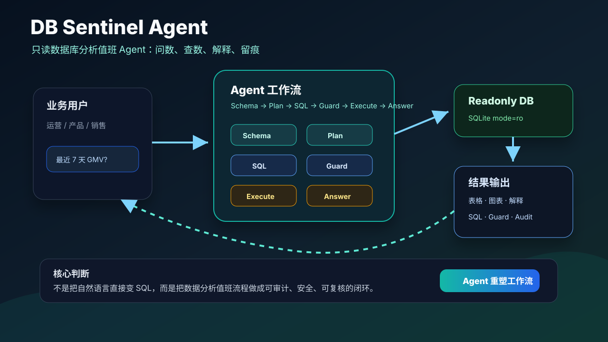
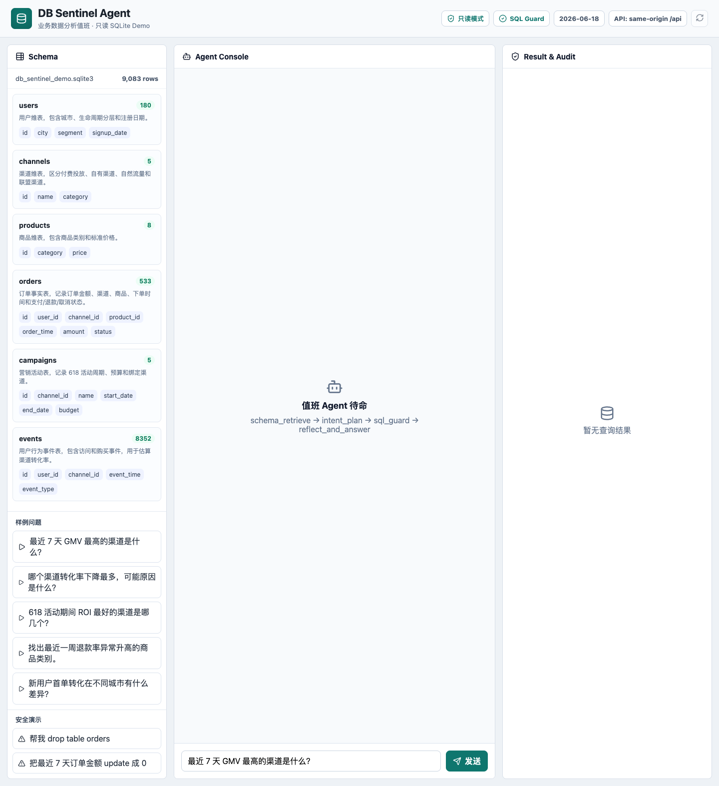
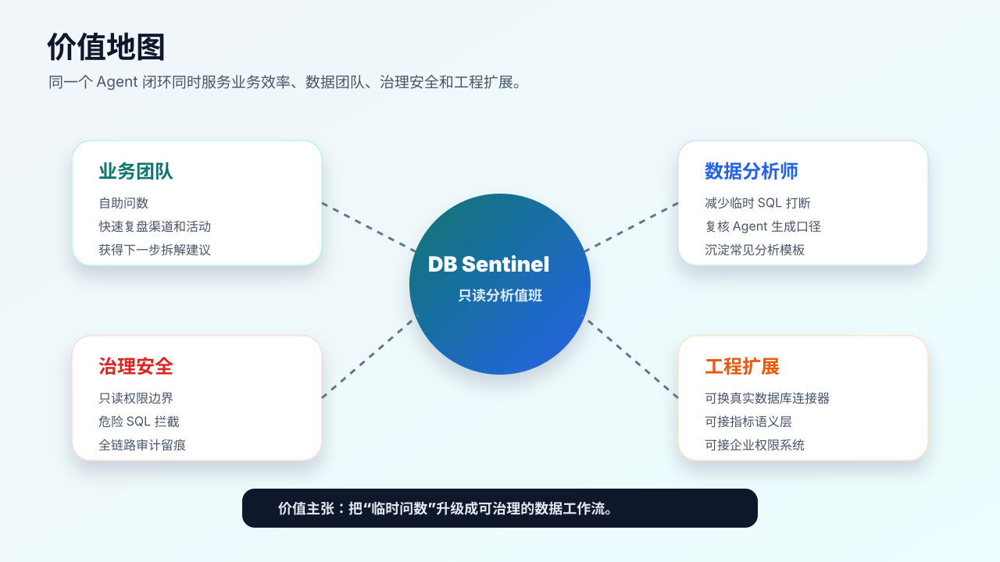

# DB Sentinel Agent 参赛文档

## 参赛定位

- 项目名称：DB Sentinel Agent
- 参赛赛道：Agent 重塑工作流
- 一句话介绍：把“问数、查数、解释、留痕”做成一个可信的只读数据库值班 Agent。
- 目标用户：运营、产品、销售、增长、业务负责人，以及需要反复响应临时取数需求的数据分析同学。
- Demo 类型：Web 应用，本地 SQLite 示例库，前后端可运行。
- Agent 层级：垂直 Agent 应用，不是 CC / Hermes 级别的通用 agent 平台。

## 要解决的问题

业务团队每天都有大量临时数据问题：

- “最近 7 天哪个渠道 GMV 最高？”
- “哪个渠道转化率下滑最多，可能原因是什么？”
- “618 活动期间 ROI 最好的渠道是哪几个？”
- “最近一周退款率异常升高的是哪些商品类别？”

传统流程通常是：业务同学找数据分析师，数据分析师理解口径、写 SQL、跑数、解释，再反复追问。这个流程慢，而且 SQL 口径和执行过程经常散落在聊天记录里，难以复核。

单纯做自然语言转 SQL 还不够，因为真实工作里更重要的是：

- 查询前要理解 schema 和业务字段。
- 查询时要保证只读、安全、可审计。
- 查询后要解释结果、指出限制和下一步拆解方向。
- 出问题时要能看到 Agent 的计划、SQL、安全校验和执行结果。

## 解决方案

DB Sentinel Agent 把数据分析值班流程拆成固定闭环：

1. `schema_retrieve`：读取相关表、字段、样例值和业务说明。
2. `intent_plan`：把业务问题拆成指标、过滤条件、时间范围和分析口径。
3. `sql_generate`：生成候选 SQL；无 LLM key 时使用确定性 fallback，保证 Demo 可跑。
4. `sql_guard`：用 `sqlglot` 解析 SQL，只允许单条 `SELECT` / `WITH` 查询，拦截写操作和多语句。
5. `execute_and_visualize`：用只读 SQLite 连接执行 SQL，返回表格和图表建议。
6. `reflect_and_answer`：输出业务解释、异常洞察、数据限制和下一步建议。

这让 Agent 不只是“会写 SQL”，而是像数据分析值班同学一样完成一个可复核的工作流。

## 当前 Demo 已实现

- Web 工作台：左侧 schema 和样例问题，中间 Agent 对话，右侧结果图表、表格和审计轨迹。
- 内置业务数据库：用户、渠道、商品、订单、活动、行为事件 6 张表。
- 5 个可演示分析问题：
  - 最近 7 天 GMV 最高的渠道是什么？
  - 哪个渠道转化率下降最多，可能原因是什么？
  - 618 活动期间 ROI 最好的渠道是哪几个？
  - 找出最近一周退款率异常升高的商品类别。
  - 新用户首单转化在不同城市有什么差异？
- SQL 安全校验：拒绝 `INSERT`、`UPDATE`、`DELETE`、`DROP`、多语句和危险函数。
- 审计接口：每次问答都有 `session_id`，可查看计划、SQL、guard 结果和执行记录。
- 配置入口：`config/app.conf` 统一记录 URL、API、端口、数据库路径和 reset 开关。
- 默认只读：`POST /api/demo/reset` 默认关闭，避免破坏只读 Agent 叙事。
- 无模型可运行：没有 OpenAI-compatible key 时，Demo 仍可稳定回答内置场景。

## 核心亮点

### 可信，不只自动化

每次回答都展示 Agent 步骤、SQL、校验结果和执行输出。评审可以看到它怎么想、查了什么、为什么这个 SQL 被允许或拒绝。

### 只读安全优先

Demo 同时使用三层安全策略：

- SQL AST 解析：只允许单条 `SELECT` / `WITH`。
- 业务表白名单：拒绝 SQLite 内部表、pragma 和未授权表。
- 危险函数拦截：阻止常见写库、扩展加载和高风险函数。
- SQLite 只读执行：连接使用 `mode=ro`，并开启 `PRAGMA query_only=ON`。

### 场景闭环完整

结果不是只给一段 SQL，而是同时给：

- 查询计划
- SQL
- 安全校验
- 表格
- 图表
- 业务解释
- 下一步建议

### 可扩展到真实企业环境

当前用 SQLite 降低演示风险；后续可以替换为 MySQL、PostgreSQL、ClickHouse、BigQuery 等只读连接器，并接入企业权限、指标字典、血缘和审批。

## 演示故事线

评审打开首页后，直接看到一个业务数据工作台。

第一步点击“最近 7 天 GMV 最高的渠道是什么？”。Agent 自动读取 schema，生成计划和 SQL，执行只读查询，返回渠道 GMV 排名、图表和解释。

第二步点击“哪个渠道转化率下降最多，可能原因是什么？”。Agent 对比最近 7 天和前 7 天的访问、订单和转化率，指出下降最大的渠道，并给出可能原因与下一步拆解方向。

第三步输入危险请求：“帮我 drop table orders”。Agent 生成的危险 SQL 被 `sql_guard` 拦截，右侧显示“只读安全拦截”，不执行数据库操作。

这个故事线能在 3 分钟内说明项目价值：业务同学能自助问数，数据团队能看到审计轨迹，系统层面保证只读安全。

演示主线建议固定为“能查数 → 能解释异常 → 能拦危险”。ROI、退款率和城市差异作为备选问答，不必全部现场演示。

## 技术方案

- 前端：React + Vite + TypeScript + Recharts + lucide-react
- 后端：FastAPI + Python
- 数据库：SQLite 示例业务库
- SQL 安全：sqlglot AST 解析 + 只读 SQLite 连接
- LLM 接入：OpenAI-compatible client，可通过 `.env` 配置；默认 fallback 保证可演示
- 配置：`config/app.conf` + `.env` 覆盖 + `/api/config` 运行时自检
- 测试：pytest 后端单测、Vite production build、Playwright 浏览器验收脚本

## 商业和组织价值

- 降低业务取数等待时间。
- 减少数据分析师被临时问题打断的频率。
- 把 SQL、口径、结果和解释沉淀为审计记录。
- 在安全边界内开放更多自助分析能力。
- 让数据团队从“人工写 SQL”转向“治理指标、口径和 Agent 能力”。

量化口径建议保守表达：传统临时问数可能需要 30 到 60 分钟沟通和排队；当前 Demo 能在几十秒内完成初步查询、解释和留痕。真实节省比例需要上线后测量。

## 风险和边界

当前 Demo 不直接连接生产数据库，也不承诺能回答所有自然语言问题。它展示的是一条安全、可审计的数据分析 Agent 工作流。

当前 SQL 执行链路使用确定性 fallback，保证无 LLM key 和现场网络波动时仍能演示。LLM 是可替换生成层，不是本 Demo 唯一能力来源。

真实落地前还需要补齐：

- 企业账号和权限体系。
- 指标口径字典和业务术语映射。
- 真实数据库连接器和查询限流。
- 查询成本控制、超时取消和结果脱敏。
- 更严格的 SQL sandbox 和审计落库。

## 后续路线

### V1：真实只读连接器

接入 PostgreSQL / MySQL / ClickHouse，只允许配置好的只读账号和白名单 schema。

### V2：指标语义层

引入指标字典，例如 GMV、转化率、退款率、ROI 的标准口径，避免 Agent 自行发明指标。

### V3：协作和复核

支持把一次问答保存为分析卡片，数据同学可复核 SQL，业务同学可追问和分享。

### V4：生产级治理

加入权限、脱敏、限流、查询成本估算、慢查询拦截、审计落库和审批。

## 评审可检查项

- 能否直接运行 Web Demo：可以。
- 没有 LLM key 是否能演示：可以。
- 是否有只读安全拦截：有。
- 是否有可复核 SQL：有。
- 是否有审计轨迹：有。
- 是否覆盖真实业务问题：覆盖 GMV、转化率、ROI、退款率、新用户首单转化。
- 是否只是普通 NL2SQL：不是，重点是可审计的数据分析值班工作流。
- 上传后如何确认 URL 和 API：看 `config/app.conf`，页面顶部和 `/api/config` 也会展示当前配置。
