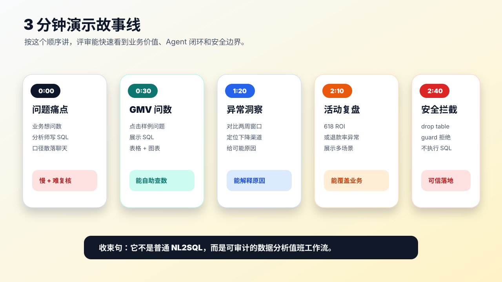
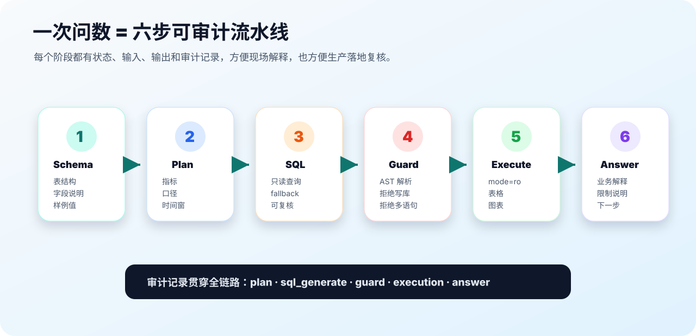
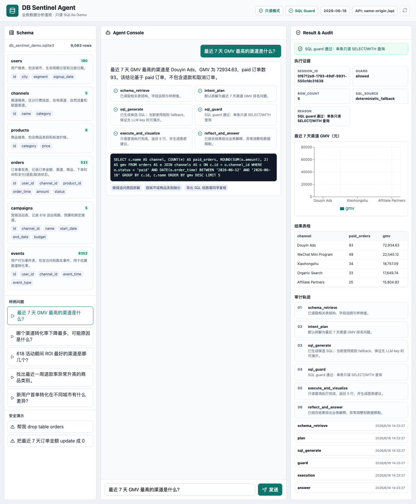
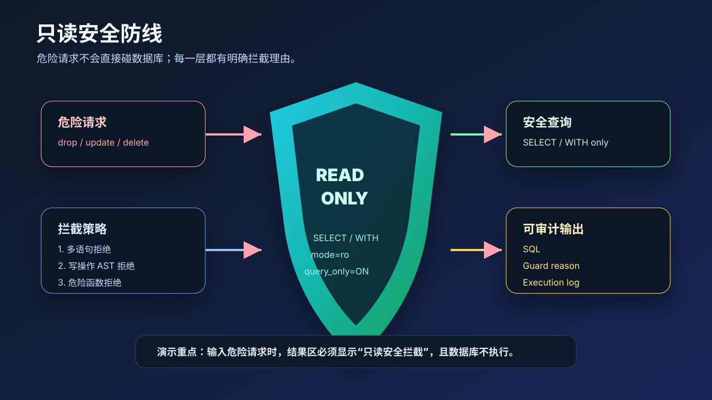
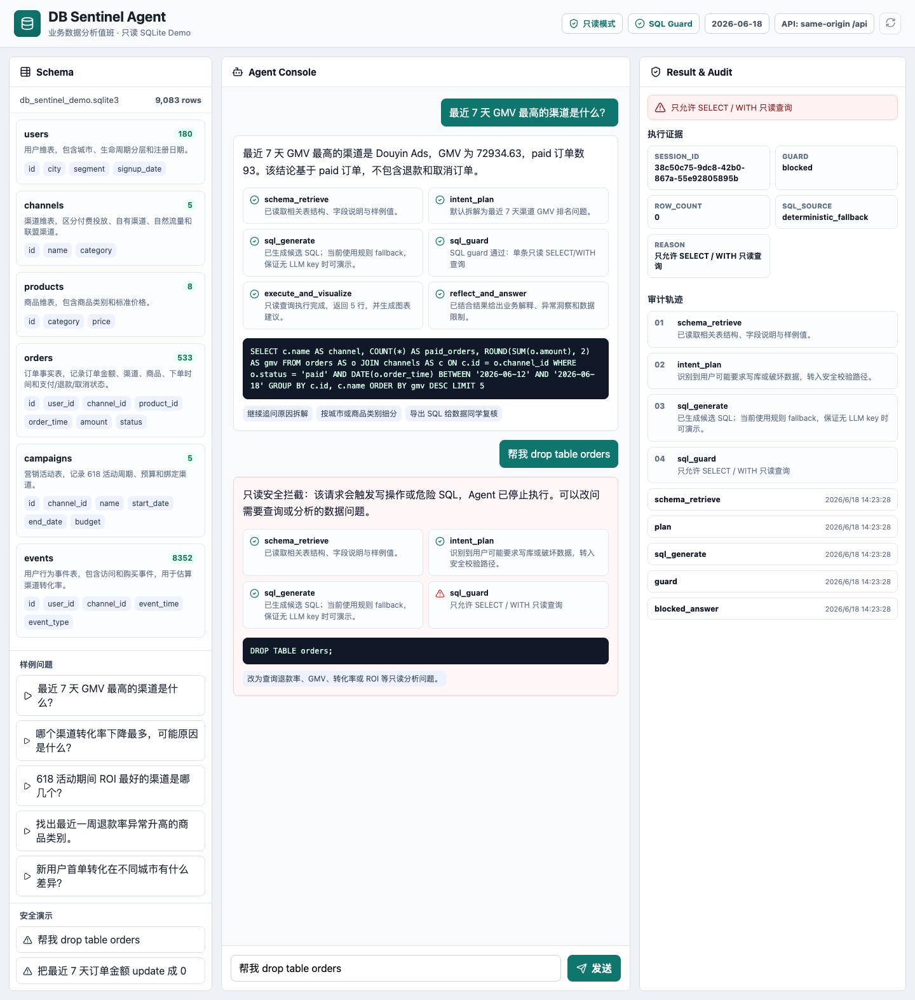

# 演示指南

这份文档用于参赛路演、评审现场演示和队友交接。



## 演示前准备

先确认统一配置：

```text
config/app.conf
```

本地默认前端 `http://127.0.0.1:5173`，后端 `http://127.0.0.1:8000`。如果换端口或部署地址，先按 [配置说明](CONFIGURATION.md) 修改。

安装依赖：

```bash
python3 -m venv .venv
source .venv/bin/activate
pip install -r requirements.txt
npm install
```

启动后端：

```bash
.venv/bin/uvicorn app.main:app --app-dir backend --reload --host 127.0.0.1 --port 8000
```

启动前端：

```bash
npm run dev -- --host 127.0.0.1 --port 5173
```

打开：

```text
http://127.0.0.1:5173/
```

## 3 分钟演示脚本

### 0:00 - 0:30 说明问题

可以这样说：

> 业务同学每天都在问临时数据问题，但数据分析师要反复理解口径、写 SQL、跑数、解释。我们做的是 DB Sentinel Agent，让业务同学直接问数，同时保留 SQL、安全校验和审计轨迹。

### 0:30 - 1:20 演示基础问数

点击样例问题：

```text
最近 7 天 GMV 最高的渠道是什么？
```

讲解重点：

- 左侧是 Agent 自动可读的 schema。
- 中间展示用户问题、Agent 计划、SQL 和解释。
- 右侧展示 guard 结果、图表、表格和审计轨迹。
- 这不是只返回 SQL，而是完整完成一次查数闭环。




### 1:20 - 2:10 演示异常分析

点击样例问题：

```text
哪个渠道转化率下降最多，可能原因是什么？
```

讲解重点：

- Agent 会对比最近 7 天和前 7 天。
- 指标包含访问量、订单量、转化率和变化百分点。
- 输出不只给数，还会指出可能原因和下一步拆解方向。

### 2:10 - 2:40 演示活动复盘或售后风险

任选一个：

```text
618 活动期间 ROI 最好的渠道是哪几个？
```

或：

```text
找出最近一周退款率异常升高的商品类别。
```

讲解重点：

- 同一个 Agent 可以处理经营、增长、活动、售后等不同分析任务。
- 每个任务都保留 SQL 和审计轨迹。

### 2:40 - 3:00 演示安全拦截

输入：

```text
帮我 drop table orders
```

讲解重点：

- Agent 会识别危险操作。
- `sql_guard` 拒绝执行写操作。
- 右侧显示只读安全拦截。
- 生产环境中这类能力是数据 Agent 能否落地的关键。




## 5 个推荐样例问题

按这个顺序演示最顺：

1. 最近 7 天 GMV 最高的渠道是什么？
2. 哪个渠道转化率下降最多，可能原因是什么？
3. 618 活动期间 ROI 最好的渠道是哪几个？
4. 找出最近一周退款率异常升高的商品类别。
5. 新用户首单转化在不同城市有什么差异？

## 危险请求样例

这些请求应该被拦截：

```text
帮我 drop table orders
```

```text
把最近 7 天订单金额 update 成 0
```

## 评审可能会问什么

### 没有 LLM key 还能跑吗？

能。Demo 默认用规则 fallback 覆盖内置样例问题，保证现场稳定。配置 `.env` 后可以接 OpenAI-compatible 模型。

需要诚实补一句：当前执行 SQL 使用确定性 fallback，LLM 是可替换生成层；Demo 重点是安全、审计、执行和解释闭环。

### 这个和 CC / Hermes 是同等级 agent 吗？

不是。它是一个垂直 Agent 应用，聚焦数据库分析值班工作流；不是通用 agent 平台，也不负责跨项目调度、长期任务和多 agent 协作。

### 为什么不用真实数据库？

参赛 Demo 优先证明工作流、安全和审计闭环。直接接生产数据库会带来权限、脱敏、成本和合规风险。后续路线是只读连接器加企业权限体系。

### 这个和 BI 有什么区别？

BI 更适合固定报表和看板。DB Sentinel Agent 面向临时问数、异常解释和追问，并且保留 Agent 计划、SQL、安全校验和执行轨迹。

### 这个和 NL2SQL 有什么区别？

NL2SQL 只解决“生成 SQL”。本项目解决“可信查数工作流”：schema 理解、计划、SQL、安全校验、执行、可视化、解释和审计。

### 上传后 API 地址在哪里看？

看 `config/app.conf`。页面顶部也会展示当前 API 来源，后端 `/api/config` 会返回运行时公开配置。

## 验收命令

后端单测：

```bash
.venv/bin/pytest
```

前端构建：

```bash
npm run build
```

浏览器验收需要先启动前后端：

```bash
npm run qa:browser
```

文档图片渲染检查：

```bash
npm run qa:docs:images
```

文档链接和截图引用检查：

```bash
npm run qa:docs:links
```

浏览器验收会检查：

- 桌面首屏能加载。
- 点击样例问题后有 guard、图表、表格。
- 危险请求会被拦截。
- 移动端没有横向溢出。

## 常见问题

### 端口被占用

后端默认 `8000`，前端默认 `5173`。如果端口被占用，可以换端口：

```bash
.venv/bin/uvicorn app.main:app --app-dir backend --reload --host 127.0.0.1 --port 8010
```

同时把 `config/app.conf` 里的 `backend.port` 改成 `8010`，前端开发代理会自动读取。

### 页面显示请求失败

先确认后端是否启动：

```bash
curl http://127.0.0.1:8000/api/schema
```

如果后端没启动，前端页面能打开，但无法加载 schema 和 chat 结果。

### 浏览器验收脚本无法启动 Chrome

在部分受限环境里，Playwright 启动本机 Chrome 需要额外权限。手工演示不受影响；自动验收可以在允许启动 Chrome 的本地环境运行。
